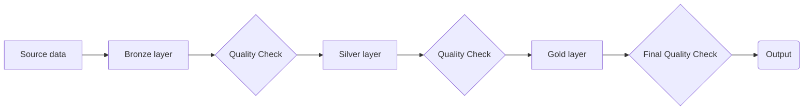

```mermaid
flowchart LR
    Source[Source data] --> Bronze[Bronze layer]
    Bronze --> Q_check{Quality Check}
    Q_check --> Silver[Silver layer]
    Silver --> Q_check_2{Quality Check}
    Q_check_2 --> Gold[Gold layer]
    Gold --> Q_check_3{Final Quality Check}
    Q_check_3 --> Final(Output)
```
